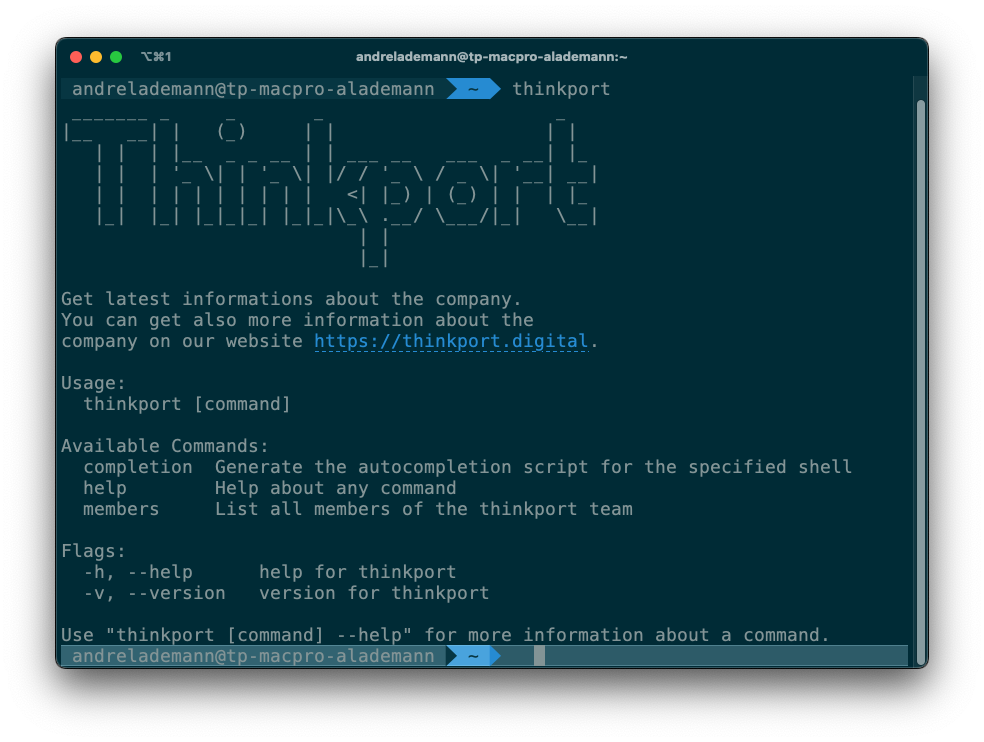

# 🌈 Thinkport CLI

[](https://github.com/vergissberlin/thinkport/actions/workflows/test.yml)

This cli tool provides a set of commands related to Thinkport.
This is a technical experiement and not intended for production use.



## 🚀 Features

* [x] List all Thinkport members or a single member
* [ ] List all Thinkport products or a single product
* [ ] Display cooperate identity information
* [ ] Display contact information
* [ ] Automatic update check
* [ ] Automatic update installation
* [ ] Automatic update notification
* [ ] Count members
* [ ] Display news

## 📀 Installation

### Homebrew (macOS and Linux)

```bash
brew install vergissberlin/tap/thinkport
```

### Manual (Windows, macOS, Linux)

Download the latest release from the [releases page](https://github.com/vergissberlin/thinkport/releases) and install it manually.

## 👩‍💻 Usage

```bash
thinkport --help
thinkport members
```

This will list all Thinkport members.

## 👷‍♀️ Development

Take a look at the [contributing guidelines](CONTRIBUTING.md).

## 📜 License

[MIT](LICENSE)
